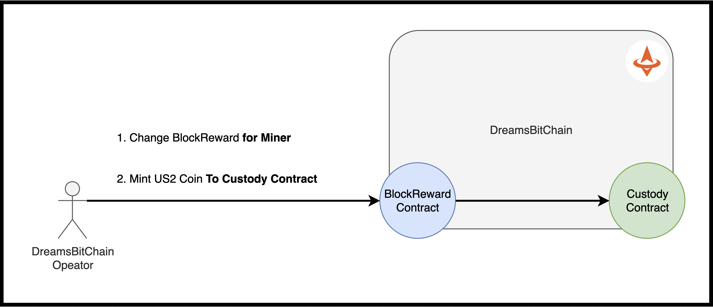

# Block Reward 
- Block Reward provide a seamless ability to **modify blockReward for a miner**.
- Block Reward provide a seamless ability to **mint the US2 Coins to the custody wallet**.
- Block Reward can be modify **by only the US2 Operator**.
- Block Reward contract is embedded from genesis.
- Default Block Reward is **0**.


```
- contract address: 0x0000000000000000000000000000000000007202
```



- 

# Become a miner
- contact us: support@us2.money

# Mint the US2 Coin
- contract us: otc@us2.money
