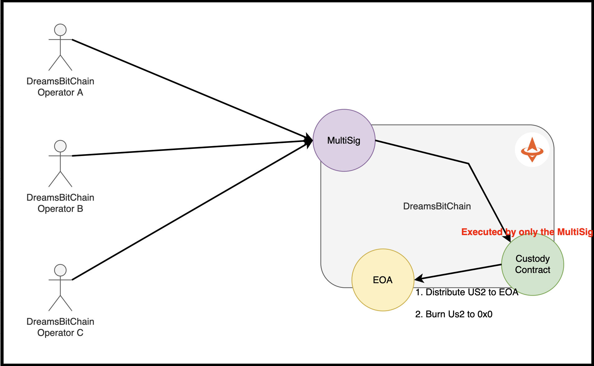

## Custody
- Custody provide the seamless ability to **distribute US2 Coin to EOA**.
- Custody provide the seamless ability to **burn US2 Coin**.
- Custody is executed **by only MultiSig**.
- Custody contract is embedded from genesis.


```
- contract address: 0x0000000000000000000000000000000000007203
```




#### Distribute US2 Coin
- contact us

#### Burn US2 Coin
- contract us