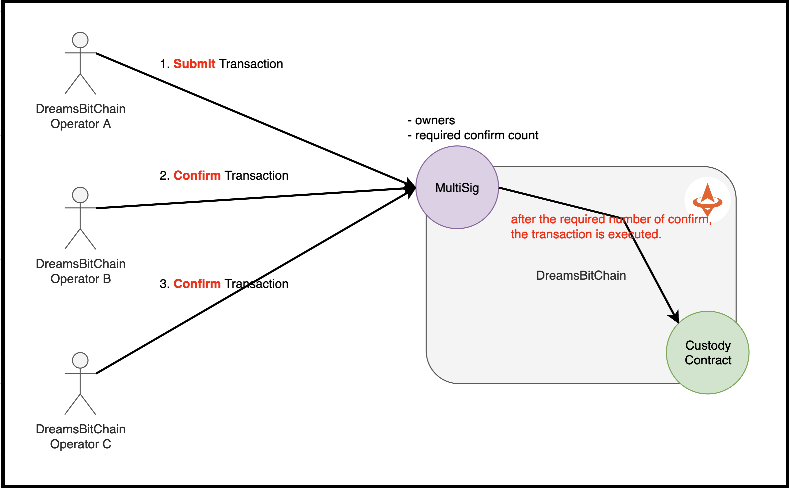

## Multi Sig
- The purpose of multisig is to increase secutiy by requiring multiple parties to agree on transactions before execution
- Multi Sig provide the seamless ability to **change BlockReward for the Miner**.
- Multi Sig provide the seamless ability to **mint US2 Coin to the Custody Contract**.
- Block Reward is executed **by only DBC Operator**.
   

- 

#### Submit Transaction
- contact us

#### Confirm Transaction
- contract us