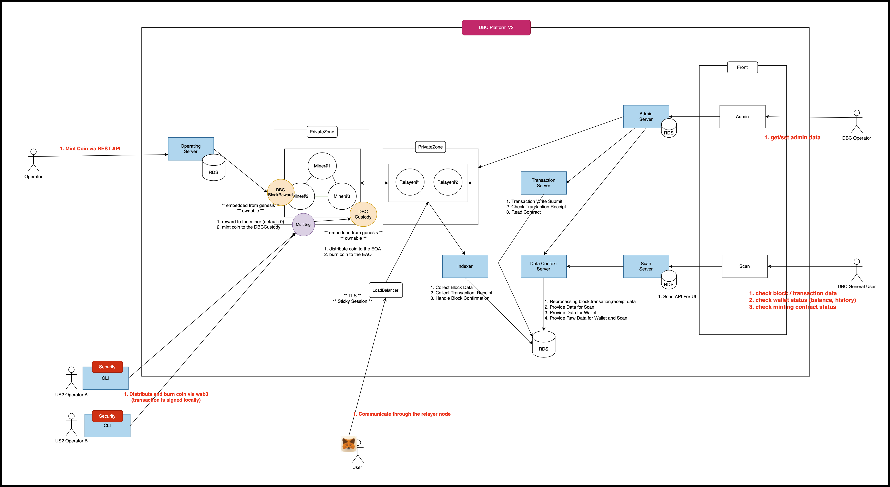

# Overview
- this doc provide about STG DBC Chain.
- TBD...

## Chain Info
```
 - rpcUri: https://stg-chain.test-us2.com
 - chainId: 1516
 - chainName: Inception
 - decimal: 18
 - symbol: US2
 - minGasPrice: 500000000000 (500GWEI)
```

## Scan(Explorer Info)
```
 - Host : https://stg-scan-front.test-us2.com/
```


### What can user do?
- The user can connect dbc chain using crypto wallet. (<<>>metamask<<>>)
- The user can import test WUSDC, WUSDT token.
- The user can receive US2 Coin, tokens using faucet API.
- The user can check block, transaction, address using the scan site.

### What can us2 operator do?
- The operator can change BlockReward for Miner (default: 0)
- The operator can mint US2 coin to Custody.
- The operator can submit distribute and burn US2 coin in Custody.

### What can us2 Sig Operator do?
- The sig operator can confirm distribute and burn US2 coin in Custody.


## System Design
