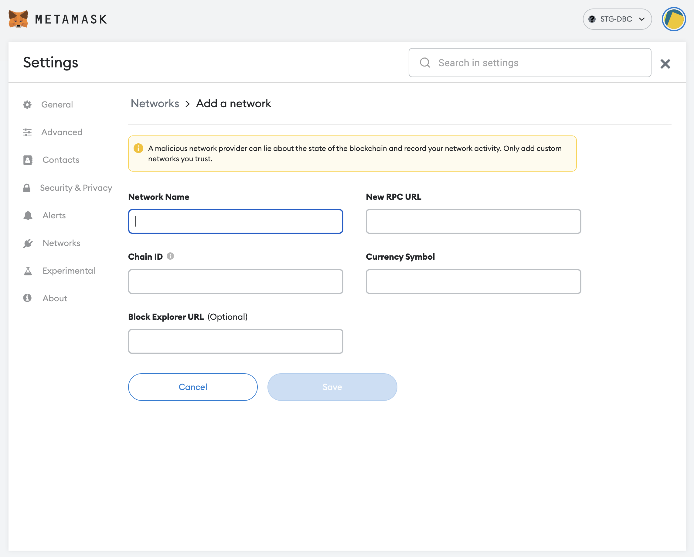

## Step 1. Setup a decentralized wallet
 - Install the Metamask in your desired environment. 

```
 ㅁ Metamask website
  - https://metamask.io/download/

 ㅁ Chrome Metamask Plugin
  - https://chrome.google.com/webstore/detail/metamask/nkbihfbeogaeaoehlefnkodbefgpgknn?hl=en
```
## Step 2-a. [Auto] Add the US2 Chain network to your Metamask
 - Coming soon

## Step 2-b. [Manual] Add the US2 Chain Network to your Metamask
 - Open the Metamask -> Settings -> Networks -> Add Network

```
   ######## DEV ########
 - Network Name: US2 DEV Chain (gymfinity) 
 - Network RPC URL: https://gymfinity.dev.us2.money
 - Chain ID: 1515
 - Currency Symbol: US2
 - Block Explorer URL: https://scan.dev.us2.money/
```

```
   ######## STG ########
 - Network Name: US2 STG Chain (inception)
 - Network RPC URL: https://inception.stg.us2.money/
 - Chain ID: 1516
 - Currency Symbol: US2
 - Block Explorer URL: https://scan.stg.us2.money/
```

```
   ######## PROD ########
 - Network Name: US2 PROD Chain (mainnet)
 - Network RPC URL: https://mainnet.us2.money/
 - Chain ID: 1517
 - Currency Symbol: US2
 - Block Explorer URL: https://scan.us2.money/
```


