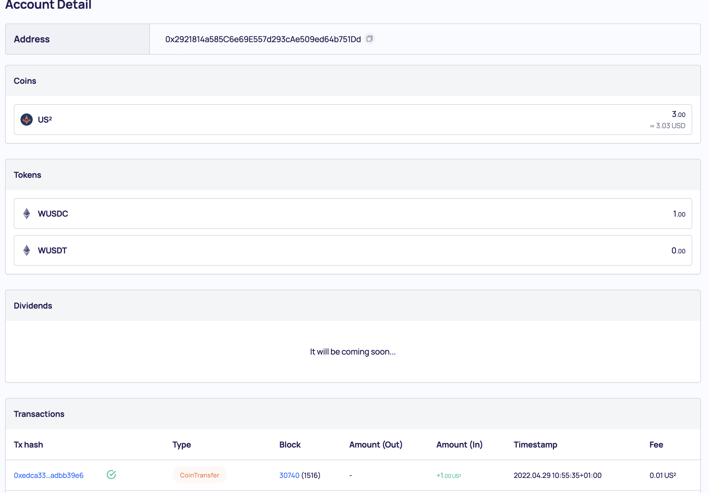

## Step 1. Faucet US2 Coin
- Modify {symbol} field to US2
- Modify {address} field to your address
- Insert url in the explorer

```
 ######## DEV ########
 - url: http://launchpad-server.dev.us2.money/test/faucets/{symbol}/{address}
 ex) https://launchpad-server.dev.us2.money/test/faucets/US2/0x2921814a585C6e69E557d293cAe509ed64b751Dd
```

```
 ######## STG ########
 - url: http://launchpad-server.stg.us2.money/test/faucets/{symbol}/{address}
 ex) https://launchpad-server.stg.us2.money/test/faucets/US2/0x2921814a585C6e69E557d293cAe509ed64b751Dd
```

```
 ######## PROD ########
 Not Supported 
```


## Step 2. (Deprecated) Faucet wUSDC Token
- Modify {symbol} field to wUSDC
- Modify {address} field to your address
- Insert url in the explorer


## Step 3. (Deprecated) Faucet wUSDT Token
- Modify {symbol} field to wUSDT
- Modify {address} field to your address
- Insert url in the explorer


## Step 4. Check your balance in the scan 
- After inserting & execute faucet url, you can get txHash, scanLink
- Click the scanLink and check the transaction & balance



